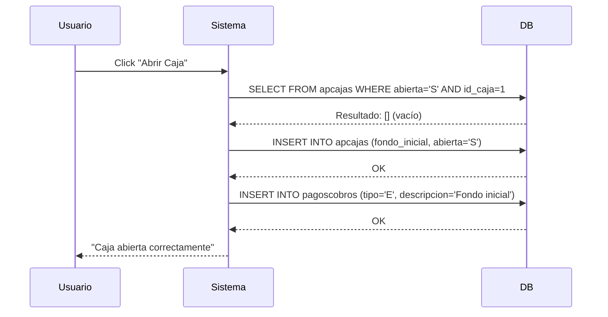
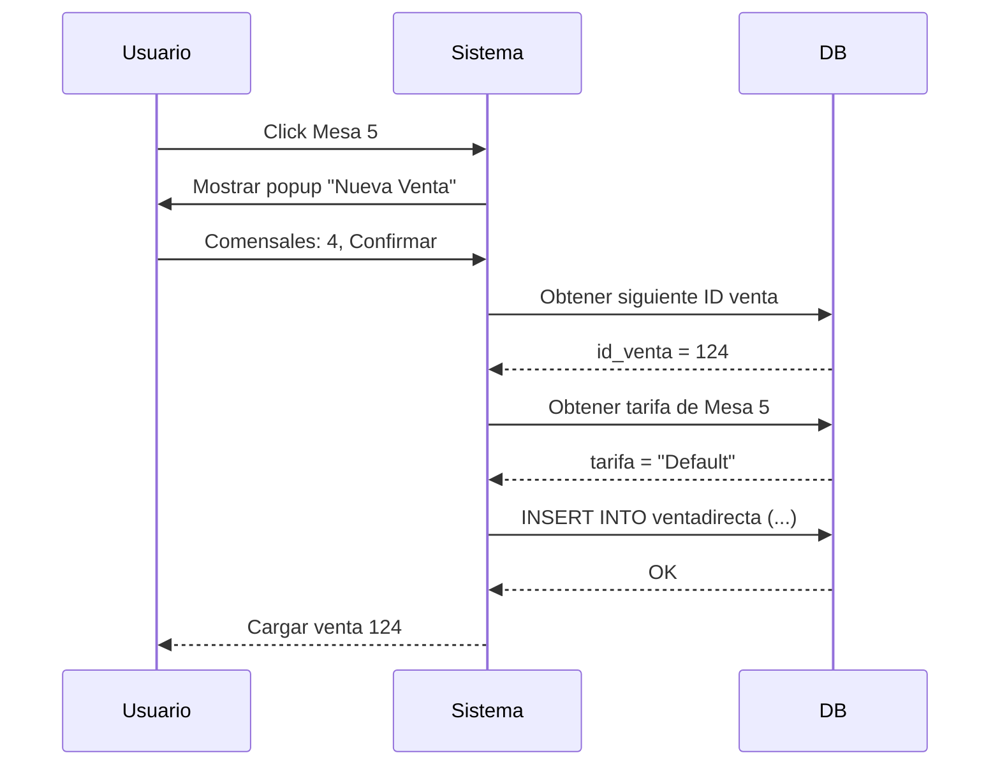
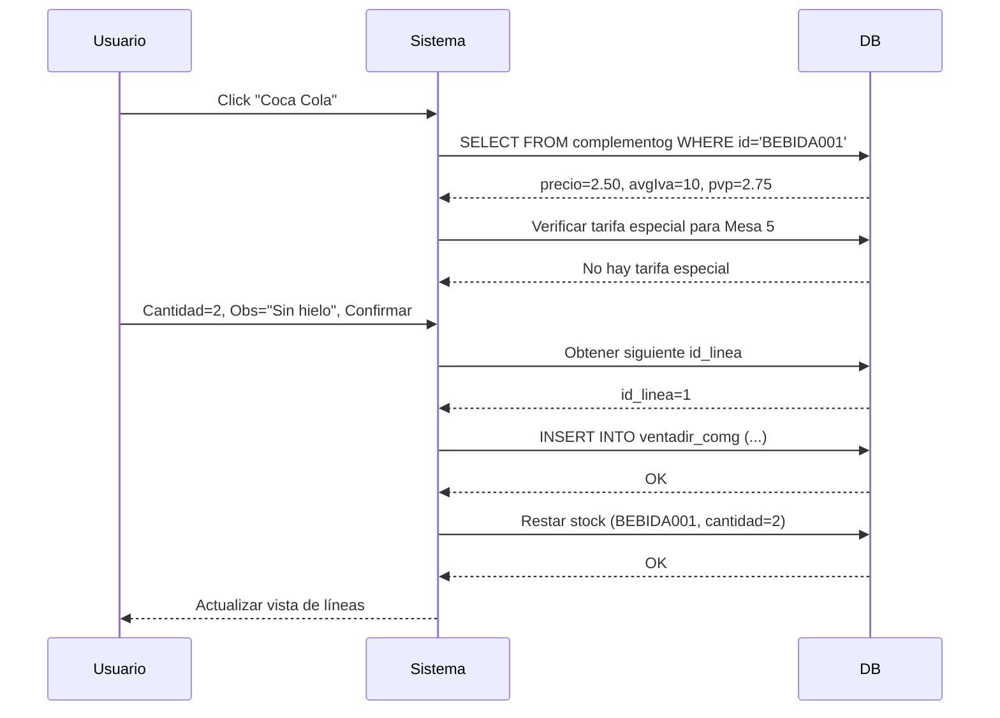
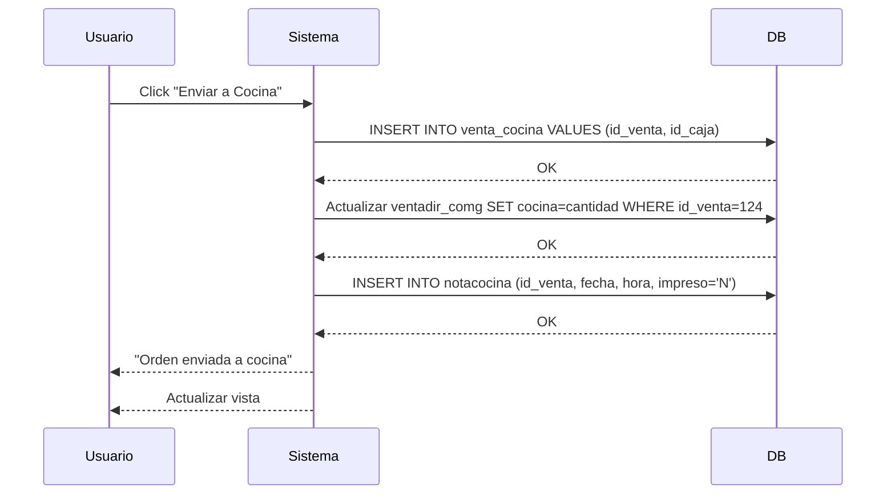
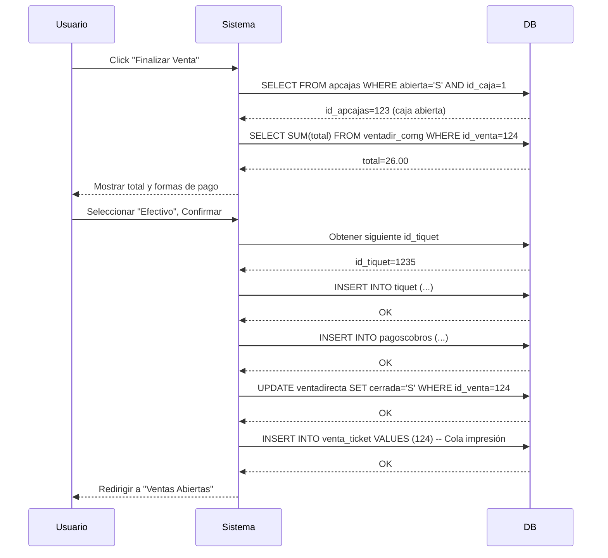
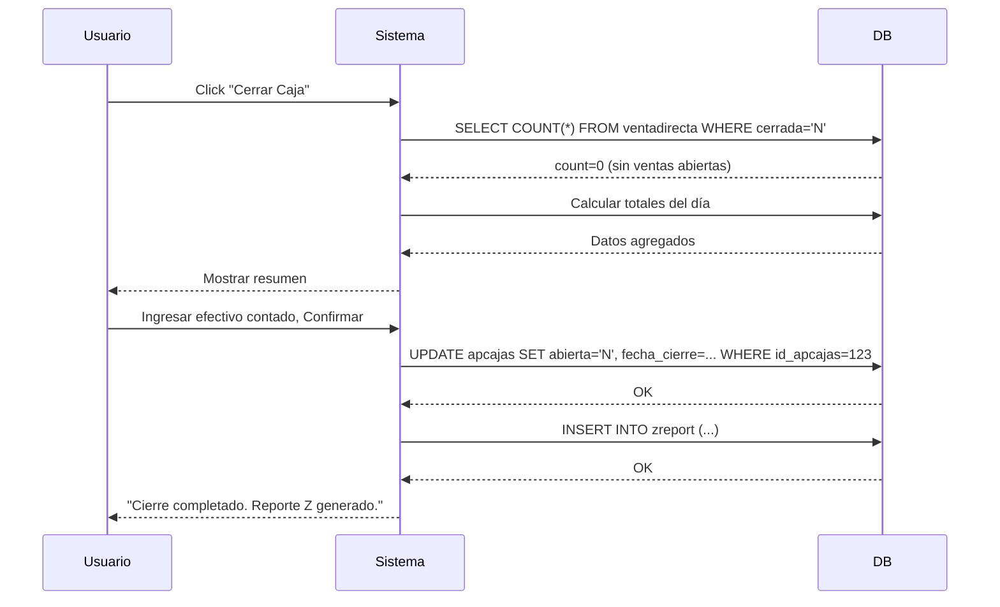

# FLUJO OPERACIONAL DEL RESTAURANTE - POS Legacy

**Fecha:** 2025-12-15
**Sistema:** SYSME POS - Sistema en Producción Real
**Modo:** Hostelería (Restaurante)

---

## 📋 TABLA DE CONTENIDOS

1. [Resumen Ejecutivo](#resumen-ejecutivo)
2. [Flujo Diario Completo](#flujo-diario-completo)
3. [Flujo 1: Apertura de Caja](#flujo-1-apertura-de-caja)
4. [Flujo 2: Login de Empleado](#flujo-2-login-de-empleado)
5. [Flujo 3: Creación de Comanda](#flujo-3-creación-de-comanda)
6. [Flujo 4: Añadir Productos](#flujo-4-añadir-productos)
7. [Flujo 5: Envío a Cocina](#flujo-5-envío-a-cocina)
8. [Flujo 6: Panel de Cocina](#flujo-6-panel-de-cocina)
9. [Flujo 7: Cobro y Cierre de Venta](#flujo-7-cobro-y-cierre-de-venta)
10. [Flujo 8: Cierre de Caja](#flujo-8-cierre-de-caja)
11. [Flujos Secundarios](#flujos-secundarios)
12. [Casos de Uso Especiales](#casos-de-uso-especiales)

---

## 🎯 RESUMEN EJECUTIVO

### Descripción del Sistema

El POS Legacy está diseñado específicamente para **hostelería** (restaurantes, bares, cafeterías) con las siguientes características:

✅ **Modo Hostelería Activado** (`hosteleria = S`)
- Gestión de mesas visuales
- Control de comensales
- Envío de comandas a cocina
- Tarifas por mesa
- Panel de cocina en tiempo real

### Actores del Sistema

| Actor | Rol | Funciones Principales |
|-------|-----|----------------------|
| **Administrador** | Configuración | Apertura/cierre caja, configuración del sistema |
| **Camarero** | Ventas | Tomar comandas, cobrar, gestionar mesas |
| **Cocinero** | Producción | Ver comandas, marcar platos preparados |
| **Cliente** | Consumidor | (No interactúa directamente con el sistema) |

### Jornada Típica del Restaurante

```
Apertura     Servicio      Cocina       Cobros      Cierre
   ↓            ↓             ↓             ↓          ↓
[08:00] → [12:00-15:00] → [Paralelo] → [14:00-16:00] → [22:00]
 Caja      Comandas      Preparación    Tickets      Cierre Z
```

---

## 🌅 FLUJO DIARIO COMPLETO

### Cronología de un Día Típico

#### 1. **08:00 - Apertura del Local**

```
Administrador/Encargado:
1. Enciende el sistema (PC con POS)
2. Inicia XAMPP → MySQL + Apache
3. Abre navegador → http://localhost/pos/pos/
4. Login como Administrador
5. Apertura de Caja → Registra fondo inicial (ej: $50.000)
```

**Sistema ejecuta:**
```sql
INSERT INTO apcajas (
    id_caja, fecha_apertura, hora_apertura,
    abierta, id_camarero, fondo_inicial
) VALUES (
    1, CURDATE(), CURTIME(),
    'S', 1, 50000.00
);
```

#### 2. **09:00-11:59 - Preparación**

- Camareros llegan y hacen login
- Configuran sus estaciones (TPV)
- Verifican stock de productos
- Preparan salón y mesas

#### 3. **12:00 - Inicio del Servicio Almuerzo**

**Flujo típico:**
```
Cliente entra → Se sienta en Mesa 5 → Camarero atiende
                                          ↓
                                   Abre comanda
                                          ↓
                                   Toma pedido
                                          ↓
                                   Envía a cocina
```

#### 4. **12:00-15:00 - Servicio Continuo**

- Múltiples comandas abiertas simultáneamente
- Cocina recibe pedidos en tiempo real
- Camareros añaden/modifican productos
- Cambios de mesa
- Aplicación de tarifas especiales

#### 5. **14:00-16:00 - Cobros**

- Cierre de comandas
- Emisión de tickets
- Pagos (efectivo/tarjeta)
- Registro en caja

#### 6. **16:00-19:00 - Descanso**

- Sistema sigue activo
- Posibles ventas esporádicas
- Preparación para cena

#### 7. **19:00-22:00 - Servicio Cena**

- Mismo flujo que almuerzo
- Mayor volumen de ventas

#### 8. **22:00 - Cierre del Local**

```
Administrador:
1. Verifica no hay ventas abiertas
2. Cierra caja → Cuenta dinero
3. Genera Reporte Z
4. Cuadra con sistema
5. Cierra sesión
6. Apaga sistema
```

**Sistema ejecuta:**
```sql
UPDATE apcajas
SET fecha_cierre = CURDATE(),
    hora_cierre = CURTIME(),
    abierta = 'N'
WHERE id_apcajas = 123;

INSERT INTO zreport (
    id_caja, fecha, total_ventas,
    total_efectivo, total_tarjeta, num_tickets
) VALUES (
    1, CURDATE(), 250000.00,
    180000.00, 70000.00, 45
);
```

---

## 🔓 FLUJO 1: APERTURA DE CAJA

### Descripción
Proceso inicial del día donde el administrador abre la caja registradora.

### Prerequisitos
- Sistema iniciado (XAMPP corriendo)
- Base de datos accesible
- NO debe haber otra caja abierta para ese TPV

### Pasos del Usuario

1. **Acceso al Sistema**
   - Navegar a `http://localhost/pos/pos/`
   - Sistema carga `index.php` → Carga configuración

2. **Login (Si requerido)**
   - Ingresar usuario y contraseña
   - Sistema valida contra tabla `camareros`

3. **Ir a Opciones de Caja**
   - Click en "Caja" o "Apertura de Caja"

4. **Ingresar Fondo Inicial**
   - Input: Monto en efectivo ($50.000)
   - Confirmar apertura

### Flujo del Sistema



### Query SQL

```sql
-- Verificar no hay caja abierta
SELECT id_apcajas FROM apcajas
WHERE abierta = 'S' AND id_caja = 1;

-- Si no existe, crear apertura
INSERT INTO apcajas (
    id_caja, fecha_apertura, hora_apertura,
    abierta, id_camarero, fondo_inicial
) VALUES (
    1,          -- ID de la caja (TPV1)
    CURDATE(),  -- Fecha actual
    CURTIME(),  -- Hora actual
    'S',        -- Abierta
    1,          -- ID del administrador
    50000.00    -- Fondo inicial
);

-- Registrar movimiento de entrada
INSERT INTO pagoscobros (
    tipo, fecha, hora, descripcion,
    importe, id_apcajas, saldo
) VALUES (
    'E',                  -- Entrada
    CURDATE(),
    CURTIME(),
    'Fondo inicial',
    50000.00,
    LAST_INSERT_ID(),    -- ID de la apertura
    50000.00             -- Saldo inicial
);
```

### Estados Posibles

| Estado | Descripción | Acción |
|--------|-------------|--------|
| ✅ Éxito | Caja abierta correctamente | Continuar operación |
| ❌ Caja ya abierta | Existe apertura activa | Mostrar error, usar caja existente |
| ❌ Error DB | No se puede conectar | Verificar MySQL está corriendo |

---

## 👤 FLUJO 2: LOGIN DE EMPLEADO

### Descripción
Autenticación del camarero para iniciar su turno.

### Pasos del Usuario

1. **Pantalla de Login**
   - Ingresar usuario (ej: "camarero1")
   - Ingresar clave
   - Click "Iniciar Sesión"

2. **Sistema Valida**
   - Consulta tabla `camareros`
   - Verifica usuario existe y está activo
   - Compara clave (⚠️ probablemente texto plano)

3. **Sesión Iniciada**
   - Carga configuración en variables de sesión
   - Redirige al menú principal

### Flujo del Sistema

```sql
-- Validar credenciales
SELECT id_camarero, nombre, rol, activo
FROM camareros
WHERE nombre = 'camarero1'
  AND clave = 'password123'  -- ⚠️ Sin hash
  AND activo = 'S';
```

### Variables de Sesión Creadas

```php
$_SESSION['id_camarero'] = 5;
$_SESSION['nombre'] = 'Juan Pérez';
$_SESSION['rol'] = 'Camarero';
$_SESSION['id_caja'] = 1;
$_SESSION['id_almacen'] = 'ALM001';
$_SESSION['tpv'] = 'TPV1';
$_SESSION['hosteleria'] = 'S';
$_SESSION['seriefactura'] = 'F';
$_SESSION['moneda'] = '€';
// ... más configuración
```

### Pantalla Post-Login

```
╔═══════════════════════════════════╗
║        SYSME POS                  ║
╠═══════════════════════════════════╣
║  Empleado: Juan Pérez             ║
║  Almacén:  Local                  ║
║  TPV:      TPV1                   ║
╠═══════════════════════════════════╣
║  [Ventas Abiertas (5)]            ║
║  [Panel de Cocina]                ║
║  [Cerrar Sesión]                  ║
╚═══════════════════════════════════╝
```

---

## 🍽️ FLUJO 3: CREACIÓN DE COMANDA

### Descripción
Camarero abre una nueva venta/comanda para una mesa.

### Contexto
- Cliente sentado en Mesa 5
- 4 comensales
- Tarifa: Default

### Pasos del Usuario

1. **Navegar a Ventas Abiertas**
   - Click "Ventas Abiertas (5)" desde menú principal
   - Sistema muestra `abiertas.php`

2. **Vista de Mesas**
   - Muestra mapa visual del salón
   - Mesas libres: Botón verde
   - Mesas ocupadas: Botón rojo con ID de venta

3. **Seleccionar Mesa 5 (Libre)**
   - Click en Mesa 5
   - Popup: "Nueva Venta"

4. **Configurar Comanda**
   - Ingresar comensales: 4 (botones +/-)
   - Confirmar mesa: Mesa 5
   - Click "Aceptar"

### Flujo del Sistema



### Query SQL

```sql
-- 1. Obtener siguiente ID de venta
SELECT (1 + id_venta) as nuevo_id
FROM ventadirecta
ORDER BY id_venta DESC
LIMIT 1;
-- Resultado: nuevo_id = 124

-- 2. Obtener tarifa de la mesa
SELECT nombre FROM tarifa
WHERE id_tarifa IN (
    SELECT id_tarifa FROM mesa
    WHERE Num_Mesa = 'M05'
);
-- Resultado: nombre = "Default"

-- 3. Crear venta
INSERT INTO ventadirecta (
    id_venta, id_empresa, id_centro, id_entidad,
    id_camarero, fecha_venta, cerrada, Num_Mesa,
    id_caja, hora, comensales, tarifa
) VALUES (
    124,        -- ID generado
    '001',      -- Empresa
    '01',       -- Centro
    '2',        -- Entidad
    5,          -- Camarero logueado
    CURDATE(),  -- 2025-12-15
    'N',        -- NO cerrada
    'M05',      -- Mesa 5
    1,          -- TPV1
    CURTIME(),  -- 13:45:30
    4,          -- 4 comensales
    'Default'   -- Tarifa
);
```

### Pantalla de Venta Abierta

```
╔═══════════════════════════════════════════╗
║  Venta: 124 - Mesa: Mesa 5 - Comensales: 4 ║
║                                   [Cerrar]  ║
╠═══════════════════════════════════════════╣
║                                             ║
║  Líneas de Venta:                           ║
║  (Vacío - Sin productos aún)                ║
║                                             ║
╠═══════════════════════════════════════════╣
║  [Añadir Producto]                          ║
║  [Enviar a Cocina]                          ║
║  [Cambiar Mesa]                             ║
║  [Finalizar Venta]                          ║
╚═══════════════════════════════════════════╝
```

---

## 🛒 FLUJO 4: AÑADIR PRODUCTOS

### Descripción
Camarero añade productos a la comanda.

### Contexto
- Venta 124 abierta (Mesa 5, 4 comensales)
- Cliente pide:
  - 2x Coca Cola
  - 1x Pizza Margarita
  - 1x Ensalada César

### Pasos del Usuario

1. **Click "Añadir Producto"**
   - Sistema muestra categorías

2. **Seleccionar Categoría "Bebidas"**
   - Sistema muestra productos de categoría

3. **Click en "Coca Cola"**
   - Sistema muestra popup configuración

4. **Configurar Producto**
   - Cantidad: 2 (botones +/-)
   - Nota: (opcional)
   - Observaciones: "Sin hielo"
   - Click "Aceptar"

5. **Repetir para Cada Producto**
   - Pizza Margarita (x1)
   - Ensalada César (x1)

### Flujo del Sistema



### Query SQL

```sql
-- 1. Obtener datos del producto
SELECT id_tipo_comg, complementog, precio, avgIva,
       (precio * (1 + (avgIva/100))) as pvp
FROM complementog
WHERE id_complementog = 'BEBIDA001';
-- Resultado: precio=2.50, avgIva=10, pvp=2.75

-- 2. Verificar tarifa especial
SELECT pvptarifa FROM comg_tarifa
WHERE id_complementog = 'BEBIDA001'
  AND id_tarifa IN (
      SELECT id_tarifa FROM mesa
      WHERE Num_Mesa IN (
          SELECT Num_Mesa FROM ventadirecta
          WHERE id_venta = 124
      )
  );
-- Resultado: Vacío (no hay tarifa especial)

-- 3. Obtener siguiente línea
SELECT 1 + MAX(id_linea) as nuevo_id
FROM ventadir_comg
WHERE id_venta = 124;
-- Resultado: nuevo_id = 1 (primera línea)

-- 4. Insertar línea de venta
INSERT INTO ventadir_comg (
    id_complementog, id_venta, cantidad, id_tipo_comg,
    id_empresa, id_linea, id_centro, PVPTiquet,
    precio, avgiva, descuento, destino, id_almacen,
    cocina, complementog, total, nota, observaciones,
    bloque_cocina
) VALUES (
    'BEBIDA001',  -- Coca Cola
    124,          -- Venta actual
    2,            -- Cantidad
    'BEBIDAS',    -- Categoría
    '001',        -- Empresa
    1,            -- Línea 1
    '01',         -- Centro
    2.75,         -- PVP con IVA
    2.50,         -- Precio sin IVA
    10.00,        -- % IVA
    0,            -- Sin descuento
    'V',          -- Destino: Venta
    'ALM001',     -- Almacén
    0,            -- No enviado a cocina
    'Coca Cola',  -- Nombre
    5.50,         -- Total (2.75 * 2)
    '',           -- Sin nota
    'Sin hielo',  -- Observaciones
    1             -- Bloque cocina 1
);

-- 5. Actualizar stock
UPDATE stock
SET stock = stock - 2
WHERE id_complementog = 'BEBIDA001'
  AND id_almacen = 'ALM001';
```

### Pantalla Actualizada

```
╔═══════════════════════════════════════════════╗
║  Venta: 124 - Mesa: Mesa 5 - Comensales: 4   ║
╠═══════════════════════════════════════════════╣
║  Líneas de Venta:                             ║
║                                               ║
║  1. Coca Cola (x2)            $5.50           ║
║     Obs: Sin hielo                            ║
║                                               ║
║  2. Pizza Margarita (x1)     $12.00           ║
║                                               ║
║  3. Ensalada César (x1)       $8.50           ║
║                                               ║
║  ─────────────────────────────────────        ║
║  TOTAL:                      $26.00           ║
║                                               ║
╠═══════════════════════════════════════════════╣
║  [Añadir Producto] [Enviar a Cocina] [Cobrar]║
╚═══════════════════════════════════════════════╝
```

---

## 👨‍🍳 FLUJO 5: ENVÍO A COCINA

### Descripción
Camarero envía la comanda a cocina para preparación.

### Prerequisitos
- Venta con productos añadidos
- Productos configurados como "requieren cocina"

### Pasos del Usuario

1. **Desde Pantalla de Venta**
   - Click "Enviar a Cocina"
   - Sistema muestra confirmación

2. **Confirmar Envío**
   - Click "Aceptar"
   - Sistema procesa envío

3. **Feedback Visual**
   - Mensaje: "Se ha enviado la orden a cocina"
   - Productos marcados como "Enviados"

### Flujo del Sistema



### Query SQL

```sql
-- 1. Insertar en cola de cocina
INSERT INTO venta_cocina
VALUES (124, 1);  -- id_venta=124, id_caja=1

-- 2. Marcar productos como enviados
UPDATE ventadir_comg
SET cocina = cantidad
WHERE id_venta = 124
  AND id_complementog IN (
      SELECT id_complementog FROM complementog
      WHERE cocina = 'Y'  -- Solo productos que van a cocina
  );

-- 3. Crear nota de cocina para impresión
INSERT INTO notacocina (
    id_venta, fecha, hora, impreso
) VALUES (
    124, CURDATE(), CURTIME(), 'N'
);
```

### Panel de Cocina (Vista Cocinero)

```
╔═══════════════════════════════════════════════╗
║           PANEL DE COCINA                     ║
╠═══════════════════════════════════════════════╣
║  COMANDAS PENDIENTES:                         ║
║                                               ║
║  ┌─────────────────────────────────────────┐ ║
║  │ Mesa 5 - Venta 124        13:50         │ ║
║  │ Comensales: 4                           │ ║
║  │                                         │ ║
║  │ □ 1x Pizza Margarita                    │ ║
║  │ □ 1x Ensalada César                     │ ║
║  │                                         │ ║
║  │ [Marcar Preparado]                      │ ║
║  └─────────────────────────────────────────┘ ║
║                                               ║
║  ┌─────────────────────────────────────────┐ ║
║  │ Mesa 3 - Venta 122        13:45         │ ║
║  │ ...                                     │ ║
║  └─────────────────────────────────────────┘ ║
╚═══════════════════════════════════════════════╝
```

---

## 🍳 FLUJO 6: PANEL DE COCINA

### Descripción
Cocinero ve comandas pendientes y marca platos como preparados.

### Actores
- Cocinero (Usuario diferente, mismo sistema)

### Pasos del Usuario

1. **Login como Cocinero**
   - Usuario: "cocinero1"
   - Clave: "..."

2. **Acceder a Panel de Cocina**
   - Click "Panel de Cocina" desde menú
   - Sistema muestra `panelcocina.php`

3. **Ver Comandas Pendientes**
   - Auto-refresh cada 10 segundos
   - Comandas ordenadas por hora de envío

4. **Preparar Plato**
   - Cocinero prepara "Pizza Margarita"
   - Click checkbox "Pizza Margarita"
   - Sistema marca como preparado

5. **Notificar Camarero**
   - Cuando todos los platos de una comanda están listos
   - Sistema puede mostrar alerta/sonido

### Query SQL

```sql
-- Obtener comandas pendientes
SELECT v.id_venta, v.Num_Mesa, v.comensales, v.hora,
       vc.id_complementog, vc.cantidad, vc.complementog,
       vc.observaciones, vc.cocina
FROM ventadirecta v
JOIN ventadir_comg vc ON v.id_venta = vc.id_venta
WHERE v.cerrada = 'N'
  AND vc.cocina < vc.cantidad  -- Aún no preparado todo
  AND vc.id_complementog IN (
      SELECT id_complementog FROM complementog
      WHERE cocina = 'Y'
  )
ORDER BY v.hora ASC;

-- Marcar plato como preparado
UPDATE ventadir_comg
SET cocina = cantidad
WHERE id_venta = 124
  AND id_linea = 2  -- Pizza Margarita
  AND id_complementog = 'PLATO001';
```

### Estados de Preparación

| Estado | cocina vs cantidad | Visual |
|--------|-------------------|--------|
| Pendiente | 0 < cantidad | ⏳ Blanco |
| En Preparación | 0 < cocina < cantidad | 🔄 Amarillo |
| Preparado | cocina == cantidad | ✅ Verde |

---

## 💰 FLUJO 7: COBRO Y CIERRE DE VENTA

### Descripción
Camarero cobra la cuenta y cierra la venta.

### Contexto
- Venta 124 (Mesa 5)
- Todos los platos servidos
- Cliente solicita cuenta
- Total: $26.00

### Pasos del Usuario

1. **Desde Pantalla de Venta**
   - Click "Finalizar Venta"
   - Sistema muestra `finaliza_venta.php`

2. **Verificar Caja Abierta**
   - Sistema valida automáticamente
   - Si caja cerrada → Error

3. **Ver Total**
   - Sistema calcula y muestra: $26.00

4. **Seleccionar Forma de Pago**
   - Radio buttons:
     - ○ Efectivo (seleccionado)
     - ○ Tarjeta
     - ○ Transferencia
   - Click "Efectivo"

5. **Confirmar Cobro**
   - Click "Aceptar"
   - Sistema procesa pago

### Flujo del Sistema



### Query SQL

```sql
-- 1. Verificar caja abierta
SELECT id_apcajas FROM apcajas
WHERE abierta = 'S' AND id_caja = 1;
-- Resultado: id_apcajas = 123

-- 2. Calcular total de la venta
SELECT ROUND(SUM(
    (precio - (IF(descuento = 0, 0, (precio * descuento)/100)))
    * cantidad
    * (1 + (avgiva / 100))
), 2) as total
FROM ventadir_comg
WHERE id_venta = 124;
-- Resultado: total = 26.00

-- 3. Obtener siguiente número de ticket
SELECT id_tiquet FROM tiquet
WHERE serie = 'F'
ORDER BY id_tiquet DESC
LIMIT 1;
-- Resultado: id_tiquet = 1234
-- Siguiente: 1235

-- 4. Crear ticket
INSERT INTO tiquet (
    serie, id_tiquet, id_empresa, id_centro,
    fecha_tiquet, iva, total, horatiquet
) VALUES (
    'F',        -- Serie
    1235,       -- Nuevo número
    '001',      -- Empresa
    '01',       -- Centro
    CURDATE(),  -- 2025-12-15
    1,          -- Con IVA
    26.00,      -- Total
    CURTIME()   -- 14:30:00
);

-- 5. Obtener siguiente id_pagoscobros y saldo
SELECT id_pagoscobros, saldo
FROM pagoscobros
WHERE id_apcajas = 123
ORDER BY id_pagoscobros DESC
LIMIT 1;
-- Resultado: id_pagoscobros=456, saldo=75000.00
-- Siguiente: 457, nuevo_saldo=75026.00

-- 6. Registrar pago
INSERT INTO pagoscobros (
    id_pagoscobros, tipo, id_venta, fecha, hora,
    descripcion, importe, id_modo_pago, id_camarero,
    saldo, id_tiquet, serie_fac, id_apcajas, id_caja
) VALUES (
    457,                    -- Siguiente ID
    'E',                    -- Entrada (cobro)
    124,                    -- Venta
    CURDATE(),
    CURTIME(),
    'ticket F1235',         -- Descripción
    26.00,                  -- Importe
    'EFECTIVO',             -- Forma de pago
    5,                      -- Camarero
    75026.00,               -- Saldo acumulado
    1235,                   -- Ticket
    'F',                    -- Serie
    123,                    -- Apertura de caja
    1                       -- Caja
);

-- 7. Cerrar venta
UPDATE ventadirecta
SET cerrada = 'S',
    serie = 'F',
    id_tiquet = 1235
WHERE id_venta = 124;

-- 8. Enviar a cola de impresión
INSERT INTO venta_ticket VALUES (124);
```

### Ticket Impreso

```
════════════════════════════════════
     RESTAURANTE EL BUEN COMER
════════════════════════════════════
Ticket: F1235
Fecha:  2025-12-15   Hora: 14:30
Mesa:   Mesa 5       Comensales: 4
Camarero: Juan Pérez
────────────────────────────────────
PRODUCTOS:
────────────────────────────────────
2x Coca Cola                  $5.50
   Obs: Sin hielo

1x Pizza Margarita          $12.00

1x Ensalada César            $8.50
────────────────────────────────────
                    SUBTOTAL: $23.64
                         IVA: $ 2.36
────────────────────────────────────
                       TOTAL: $26.00
────────────────────────────────────
Forma de Pago: EFECTIVO
────────────────────────────────────
   ¡Gracias por su visita!
════════════════════════════════════
```

---

## 🔒 FLUJO 8: CIERRE DE CAJA

### Descripción
Al final del día, administrador cierra la caja y genera reporte Z.

### Prerequisitos
- NO debe haber ventas abiertas
- Todas las transacciones del día registradas

### Pasos del Usuario

1. **Verificar Ventas Abiertas**
   - Ir a "Ventas Abiertas"
   - Verificar lista vacía
   - Si hay ventas → Cerrarlas primero

2. **Acceder a Cierre de Caja**
   - Click "Caja" → "Cerrar Caja"

3. **Contar Dinero Físico**
   - Efectivo en cajón
   - Separar por denominación

4. **Ingresar Valores**
   - Total efectivo contado
   - Total tarjetas (desde TPV bancario)
   - Otros medios de pago

5. **Generar Reporte Z**
   - Sistema calcula diferencia
   - Muestra resumen del día
   - Click "Confirmar Cierre"

6. **Imprimir Reporte**
   - Ticket con totales
   - Guardar/firmar para contabilidad

### Flujo del Sistema



### Query SQL

```sql
-- 1. Verificar no hay ventas abiertas
SELECT COUNT(*) as cuenta
FROM ventadirecta
WHERE cerrada = 'N';
-- Resultado: cuenta = 0 (OK para cerrar)

-- 2. Obtener totales del día
SELECT
    COUNT(DISTINCT p.id_venta) as num_tickets,
    SUM(CASE WHEN p.id_modo_pago = 'EFECTIVO' THEN p.importe ELSE 0 END) as total_efectivo,
    SUM(CASE WHEN p.id_modo_pago = 'TARJETA' THEN p.importe ELSE 0 END) as total_tarjeta,
    SUM(p.importe) as total_ventas
FROM pagoscobros p
WHERE p.id_apcajas = 123
  AND p.tipo = 'E'  -- Solo entradas (cobros)
  AND p.descripcion LIKE 'ticket%';
-- Resultado:
-- num_tickets=45, total_efectivo=180000, total_tarjeta=70000, total_ventas=250000

-- 3. Cerrar apertura de caja
UPDATE apcajas
SET fecha_cierre = CURDATE(),
    hora_cierre = CURTIME(),
    abierta = 'N'
WHERE id_apcajas = 123;

-- 4. Crear Reporte Z
INSERT INTO zreport (
    id_caja, fecha, total_ventas,
    total_efectivo, total_tarjeta, num_tickets
) VALUES (
    1,          -- TPV1
    CURDATE(),  -- 2025-12-15
    250000.00,  -- Total del día
    180000.00,  -- Efectivo
    70000.00,   -- Tarjeta
    45          -- Número de tickets
);
```

### Reporte Z Impreso

```
════════════════════════════════════
        REPORTE Z - CIERRE
════════════════════════════════════
Caja:   TPV1
Fecha:  2025-12-15
Hora:   22:15:00
────────────────────────────────────
APERTURA:
Fecha/Hora:  2025-12-15 08:00:00
Fondo Inicial:            $50,000.00
────────────────────────────────────
CIERRE:
Fecha/Hora:  2025-12-15 22:15:00
────────────────────────────────────
RESUMEN DE VENTAS:
────────────────────────────────────
Número de Tickets:                45
Total Efectivo:          $180,000.00
Total Tarjeta:            $70,000.00
Otros Medios:                  $0.00
────────────────────────────────────
TOTAL VENTAS:            $250,000.00
────────────────────────────────────
CAJA:
────────────────────────────────────
Fondo Inicial:            $50,000.00
+ Ingresos Efectivo:     $180,000.00
- Retiros:                 $50,000.00
────────────────────────────────────
Efectivo Esperado:       $180,000.00
Efectivo Contado:        $180,000.00
Diferencia:                    $0.00
────────────────────────────────────
       CUADRE PERFECTO ✓
════════════════════════════════════
Firma Responsable: ______________
════════════════════════════════════
```

---

## 🔄 FLUJOS SECUNDARIOS

### Flujo A: Cambio de Mesa

**Contexto:** Cliente cambia de Mesa 5 a Mesa 8 durante el servicio.

**Pasos:**
1. Camarero abre venta actual (Venta 124)
2. Click "Cambiar Mesa"
3. Seleccionar nueva mesa: Mesa 8
4. Confirmar

**SQL:**
```sql
-- Obtener tarifa de nueva mesa
SELECT nombre FROM tarifa
WHERE id_tarifa IN (
    SELECT id_tarifa FROM mesa
    WHERE Num_Mesa = 'M08'
);

-- Actualizar venta
UPDATE ventadirecta
SET Num_Mesa = 'M08',
    tarifa = 'VIP'  -- Si la nueva mesa tiene tarifa especial
WHERE id_venta = 124;

-- Recalcular precios si hay tarifa especial
UPDATE ventadir_comg vc
SET vc.precio = ct.pvptarifa / (1 + (vc.avgiva/100)),
    vc.total = ct.pvptarifa * vc.cantidad
FROM comg_tarifa ct
WHERE vc.id_venta = 124
  AND vc.id_complementog = ct.id_complementog
  AND ct.id_tarifa IN (
      SELECT id_tarifa FROM mesa WHERE Num_Mesa = 'M08'
  );
```

---

### Flujo B: Modificar Línea de Venta

**Contexto:** Cliente cambia de opinión, quiere 3 Coca Colas en lugar de 2.

**Pasos:**
1. Desde pantalla de venta
2. Click en línea "Coca Cola (x2)"
3. Modificar cantidad: 3
4. Click "Actualizar"

**SQL:**
```sql
-- Actualizar cantidad
UPDATE ventadir_comg
SET cantidad = 3,
    total = PVPTiquet * 3
WHERE id_venta = 124
  AND id_linea = 1;

-- Actualizar stock (restar 1 adicional)
UPDATE stock
SET stock = stock - 1
WHERE id_complementog = 'BEBIDA001'
  AND id_almacen = 'ALM001';
```

---

### Flujo C: Eliminar Línea de Venta

**Contexto:** Cliente cancela un plato antes de que llegue a cocina.

**Pasos:**
1. Click en línea a eliminar
2. Click "Eliminar"
3. Confirmar eliminación

**SQL:**
```sql
-- Guardar en audit trail
INSERT INTO lineaseliminadas (
    id_venta, id_linea, id_complementog,
    cantidad, total, fecha, hora, id_camarero, motivo
)
SELECT id_venta, id_linea, id_complementog,
       cantidad, total, CURDATE(), CURTIME(), 5, 'Cancelado por cliente'
FROM ventadir_comg
WHERE id_venta = 124 AND id_linea = 3;

-- Devolver stock
UPDATE stock s
SET s.stock = s.stock + vc.cantidad
FROM ventadir_comg vc
WHERE vc.id_venta = 124
  AND vc.id_linea = 3
  AND s.id_complementog = vc.id_complementog
  AND s.id_almacen = vc.id_almacen;

-- Eliminar línea
DELETE FROM ventadir_comg
WHERE id_venta = 124 AND id_linea = 3;
```

---

### Flujo D: Dividir Cuenta

**Contexto:** 4 comensales quieren pagar por separado.

**Implementación en POS Legacy:** ⚠️ **NO SOPORTADO NATIVAMENTE**

**Workaround Manual:**
1. Crear 4 ventas nuevas
2. Mover líneas manualmente a cada venta
3. Cobrar cada venta independientemente

---

### Flujo E: Descuentos

**Contexto:** Aplicar 10% de descuento a una línea.

**Pasos:**
1. Click en línea
2. Click "Opciones"
3. Ingresar descuento: 10%
4. Confirmar

**SQL:**
```sql
-- Aplicar descuento
UPDATE ventadir_comg
SET descuento = 10,
    total = PVPTiquet * cantidad * (1 - (descuento/100))
WHERE id_venta = 124
  AND id_linea = 1;
```

---

## 🚨 CASOS DE USO ESPECIALES

### Caso 1: Caja Ya Abierta al Inicio del Día

**Problema:** Sistema muestra error "Caja ya abierta" pero no hay nadie trabajando.

**Causa:** Cierre de caja no se hizo el día anterior.

**Solución:**
1. Administrador hace login
2. Verifica ventas abiertas del día anterior
3. Cierra ventas pendientes
4. Cierra caja del día anterior
5. Abre nueva caja para hoy

**SQL:**
```sql
-- Verificar cuál caja está abierta
SELECT * FROM apcajas
WHERE abierta = 'S';

-- Cerrar caja anterior
UPDATE apcajas
SET abierta = 'N',
    fecha_cierre = CURDATE(),
    hora_cierre = CURTIME()
WHERE id_apcajas = 122;  -- La que estaba abierta
```

---

### Caso 2: Venta Abandonada (Mesa Sin Cobrar)

**Problema:** Mesa 3 tiene venta abierta de hace 2 días.

**Causa:** Cliente se fue sin pagar / Error operativo.

**Solución:**
1. Revisar venta
2. Si es impago legítimo → Registrar como pérdida
3. Anular venta

**SQL:**
```sql
-- Anular venta (soft delete)
UPDATE ventadirecta
SET cerrada = 'S',
    observaciones = CONCAT(observaciones, ' - ANULADA: Cliente no pagó')
WHERE id_venta = 120;

-- Devolver stock
UPDATE stock s
SET s.stock = s.stock + vc.cantidad
FROM ventadir_comg vc
WHERE vc.id_venta = 120
  AND s.id_complementog = vc.id_complementog;
```

---

### Caso 3: Diferencia en Cierre de Caja

**Problema:** Efectivo contado ($179,500) ≠ Efectivo esperado ($180,000).

**Diferencia:** -$500 (faltante)

**Acciones:**
1. Recontar efectivo
2. Verificar tickets no registrados
3. Revisar movimientos de caja
4. Registrar diferencia

**SQL:**
```sql
-- Registrar diferencia
INSERT INTO pagoscobros (
    tipo, fecha, hora, descripcion,
    importe, id_apcajas, id_caja
) VALUES (
    'S',                            -- Salida
    CURDATE(),
    CURTIME(),
    'Diferencia en cierre de caja',
    500.00,                         -- Faltante
    123,
    1
);
```

---

### Caso 4: Error en Producto Enviado a Cocina

**Problema:** Se envió "Pizza Pepperoni" pero cliente pidió "Pizza Margarita".

**Solución:**
1. Eliminar línea incorrecta
2. Añadir línea correcta
3. Enviar nueva comanda a cocina
4. Notificar a cocina del error

⚠️ **Limitación:** Una vez enviado a cocina, el POS Legacy NO permite editar fácilmente.

**Workaround:**
- Añadir producto correcto
- Marcar incorrecto como eliminado en comentarios
- Comunicación verbal con cocina

---

## 📊 MÉTRICAS DEL FLUJO

### Tiempos Promedio

| Operación | Tiempo Estimado |
|-----------|-----------------|
| Apertura de caja | 2-3 minutos |
| Login de empleado | 10 segundos |
| Crear comanda nueva | 30 segundos |
| Añadir 1 producto | 15-20 segundos |
| Enviar a cocina | 10 segundos |
| Cobrar venta | 1-2 minutos |
| Cierre de caja | 10-15 minutos |

### Volumen Típico (Día Normal)

| Métrica | Valor |
|---------|-------|
| Comandas/día | 40-60 |
| Productos/comanda | 3-5 |
| Transacciones/día | 45-70 |
| Tiempo en mesa | 45-90 min |
| Rotación de mesas | 2-3 veces/día |

---

## 🎯 CONCLUSIONES Y OBSERVACIONES

### Fortalezas del Flujo Operacional

✅ **Flujo Lineal y Claro**
- Pasos bien definidos
- Interfaz simple
- Mínima capacitación requerida

✅ **Tiempo Real**
- Cocina ve comandas al instante
- Actualización inmediata de mesas
- Sincronización entre TPVs

✅ **Mapa Visual de Mesas**
- Intuitivo para camareros
- Estado claro (libre/ocupada)
- Gestión eficiente del salón

### Debilidades y Limitaciones

❌ **Sin Workflow de Aprobación**
- No hay validación de supervisor
- No hay límites de descuento
- No hay control de cambios post-cocina

❌ **Gestión Limitada de Errores**
- Difícil deshacer envío a cocina
- No hay historial de cambios detallado
- Limitado audit trail

❌ **Funcionalidades Ausentes**
- NO soporta propinas
- NO soporta división de cuenta
- NO soporta reservas integradas
- NO soporta delivery

❌ **Dependencia Manual**
- Contadores manuales (riesgo de duplicados)
- No hay validación automática de stock bajo
- Cierre de caja requiere conteo físico manual

### Recomendaciones para Nuevo Sistema

**Alta Prioridad:**
1. **Workflow de Estados**
   - Estados claros para ventas (draft, sent_kitchen, served, paid)
   - Transiciones controladas
   - Validaciones en cada paso

2. **Auditoría Completa**
   - Log de todos los cambios
   - Quién, cuándo, qué
   - Reversión de acciones

3. **Gestión de Errores**
   - Cancelación de comandas con autorización
   - Modificación post-envío con tracking
   - Notificaciones automáticas a cocina

**Media Prioridad:**
4. **División de Cuenta**
   - Split por comensales
   - Split por productos
   - Split personalizado

5. **Propinas**
   - Sugerencia automática (10%, 15%, 20%)
   - Registro separado
   - Distribución entre empleados

6. **Reservas**
   - Integración con mesas
   - Bloqueo de horarios
   - Notificaciones

**Baja Prioridad:**
7. **Delivery**
   - Estado de pedido
   - Tracking de repartidor
   - Integración con apps externas

---

**FIN DEL DOCUMENTO**

Análisis de Flujo Operacional del POS Legacy - Paso 3 de 3 Completado
